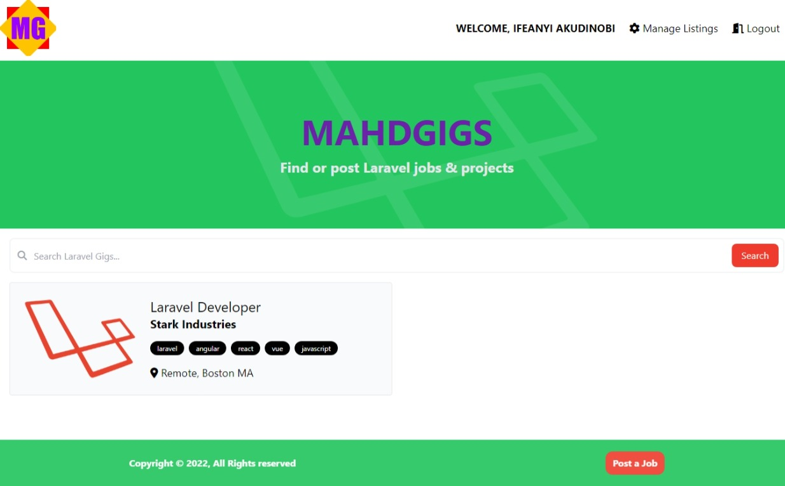
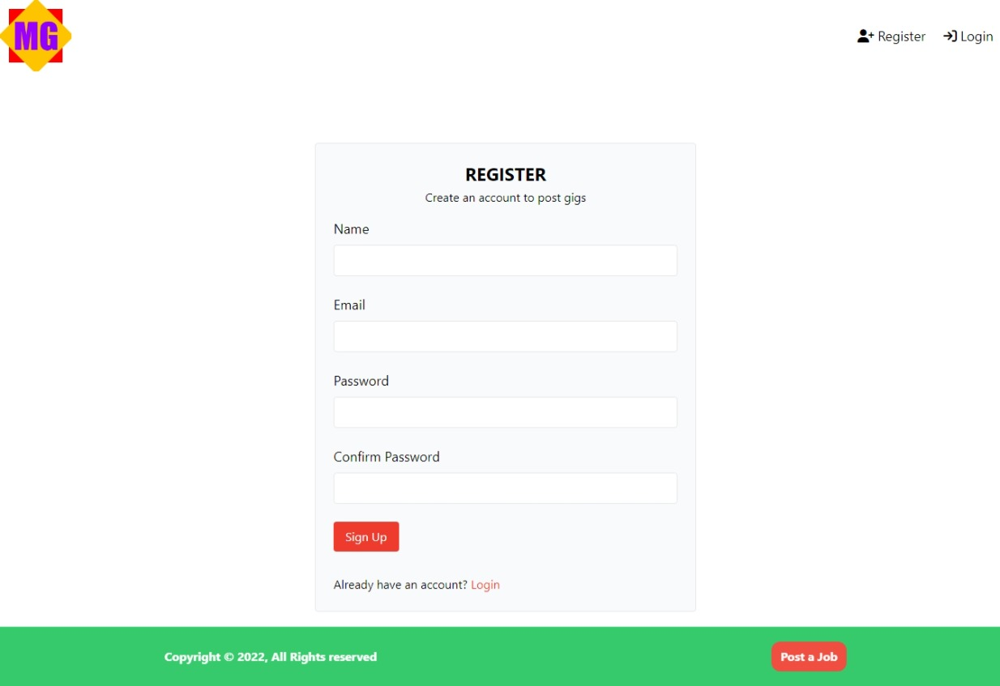
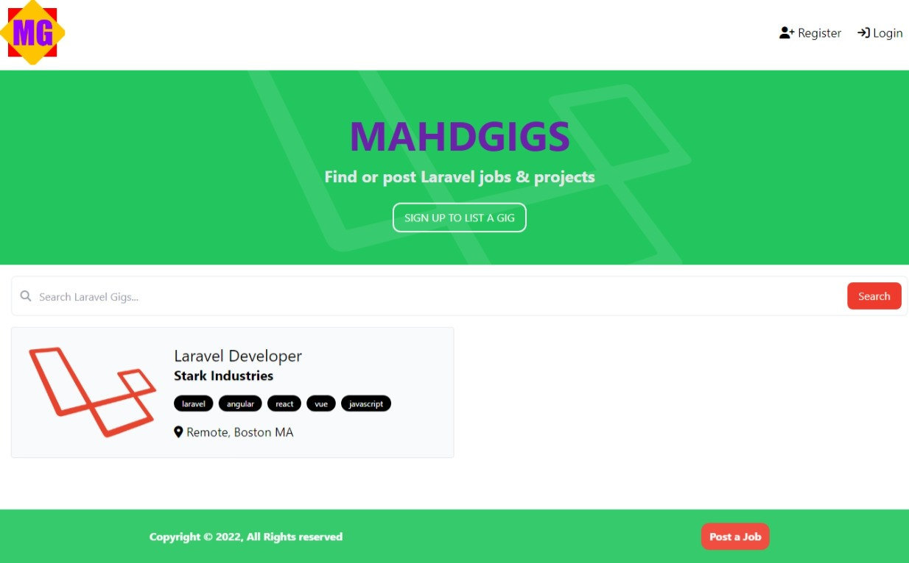
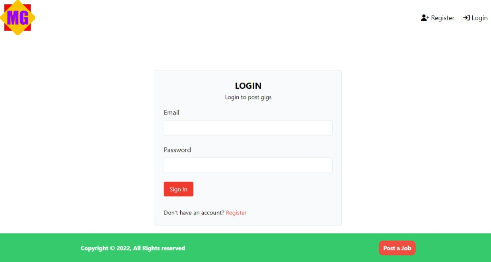

## About Mahdgigs

Mahdgigs is a job posting application. It's a web application built with Laravel & MySQL - (backend) and Blade templating language. It fully supports the CRUD functionality with Laravel. We believe posting jobs must be an enjoyable and easy experience to be truly fulfilling. Mahdgigs takes the pain out of posting jobs and gigs by easing common tasks.

Mahdgigs is accessible, powerful, and provides tools required for large, robust job postings.

## Bootstraping Mahdgigs
**1. Development**

After cloning this project, you can bootstrap the application using:
- `composer install && npm install`

then the application assets:
- `npm run dev`

Open a new terminal and start the application server using:
- `php artisan serve`

**2. Production**

Install package dependencies using composer and npm as in the previous step, then:
- `npm run build`

Start the application server:
- `php artisan serve`

Notice that the vite server needed in development is not needed in production. This is made possible when `npm run build` is ran. This bootstraps the application assets into a **build** directory in the **public folder**.

## Mahdgigs Sponsors

We would like to extend our thanks to the following sponsors for funding Mahdgigs development. If you are interested in becoming a sponsor, please email the Mahdgigs at ifeanyichukwuakudinobi86@gmail.com

### Premium Partners

-   **[The Mahd Scientist](https://linkedin.com/in/themahdscientist)**
-   **Emmanuel Akudinobi**

## License

The Mahdgigs application is open-sourced software licensed under the [MIT license](https://opensource.org/licenses/MIT).
